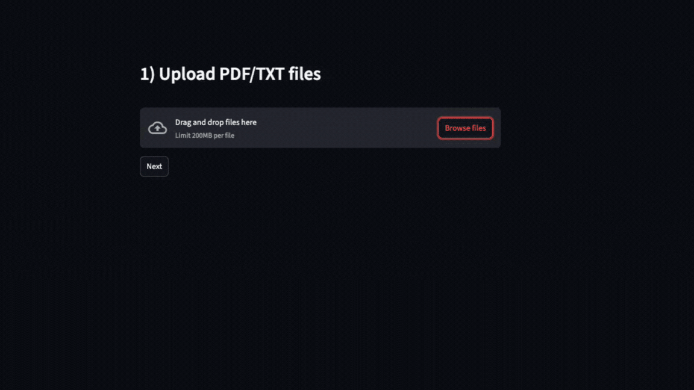

# RegulAIte

**RegulAIte** is a policy-focused **Q&A assistant** built for businesses—especially HR, compliance, or legal teams—to get accurate answers from internal documents without sifting through lengthy PDFs.

---
## 🎯 The Business Need

- **Stop policy confusion & reduce support tickets**: Employees can ask specific questions—e.g., leave entitlements, code of conduct rules—and get immediate responses based on the official handbook.
- **Improve accuracy and reduce hallucinations**: By retrieving context from trusted documents before querying the LLM, RAG ensures that answers are grounded in real data—not outdated or incorrect facts.
- **Maintain data control**: Businesses retain full control over the documents used—meaning nothing leaks into LLM training data or inference pipelines.

---

## 🚀 Key Features

- **Easy document upload & indexing**: Upload company handbooks, employee policies, or any text/PDF files via a clean Streamlit UI.  
- **Retrieval‑Augmented Generation**: Uses ChromaDB to find relevant excerpts and include them in the prompt.  
- **Dual‑Model Inference**:  
  - **OpenAI gpt-4o-mini** for fast, reliable cloud inference.  
  - **Qwen3-235B-A22B-Instruct-2507** (via Hugging Face) as an open‑source alternative.  
- **Source citations**: Every answer includes expandable original snippets for verification.  
- **Modular, beginner‑friendly code**: Clear folder structure (`app/` for logic, `ui/` for UI) and a simple LLM factory.

---

## 🎬 Demo

Here's a quick look at **RegulAIte** in action:



---

## 📦 Tech Stack

- **Python 3.10+**  
- **LangChain** for pipeline orchestration  
- **ChromaDB** for vector storage & similarity search  
- **Sentence‑Transformers** (`all-MiniLM-L6-v2`) for embeddings  
- **OpenAI gpt-4o-mini** via `langchain-openai`  
- **Qwen3-235B-A22B-Instruct-2507** via Hugging Face (`HF_TOKEN`)  
- **Streamlit** for the web interface  
- **dotenv** for environment‑based API keys  

---

## ⚙️ Installation & Quickstart

1. **Clone the repo**  
   ```bash
   git clone https://github.com/yourusername/regulaite.git
   cd regulaite
   ```

2. **Create a virtual environment & install dependencies**
    ```bash
    python3 -m venv .venv
    source .venv/bin/activate
    pip install -r requirements.txt
    ```

3. **Create your .env file in the project root with these entries**
    ```bash
    # For OpenAI inference
    OPENAI_API_KEY=sk-...

    # For Hugging Face Qwen inference
    HF_TOKEN=hf-...
    ```
4. **Run the app**
    ```bash
   streamlit run ui/streamlit_app.py
    ```
5. **Use the UI**
- Upload your PDF/TXT documents under Index Documents.  
- Ask natural‑language questions in the chat box.
- See answers + source snippets.

---

## ⚠️ Resource Requirements
- **Qwen via Hugging Face** Running Qwen‑2.5/3 locally in full FP32 precision may require 32 GB+ VRAM .
- If you don’t have that, you can still use OpenAI **gpt-4o-mini** in the cloud.
- **LLaMA‑3** inference via Hugging Face is also possible if you have appropriate permissions.

---

## 📁 Folder Structure
  
    regulaite/
    ├── app/                 # Core logic: ingestion, embeddings, QA chain, LLM factory
    ├── ui/                  # Streamlit UI
    ├── data/                # raw upload directory
    ├── vectorstore/         # persisted Chroma embeddings
    ├── models/              # local model weights (optional)
    ├── .env                 # your API keys
    ├── requirements.txt     # Python dependencies
    └── README.md

---

## 🤝 Contributing
Interested in helping out? Please read our [Contributing Guidelines](CONTRIBUTING.md) to get started.
